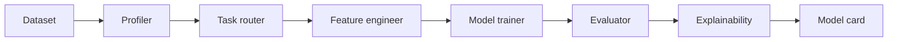

# 02 - Agentic ML Pipeline (Auto-EDA to Model Card)

[](https://github.com/milos-plavsic/agentic-ml-pipeline/actions/workflows/ci.yml)
[](https://www.python.org/downloads/)

An AI-driven machine learning workflow that inspects tabular data, selects modeling strategy, trains candidate models, explains outcomes, and exports a reproducible model card.

## Quickstart

```bash
make install
make run
make api
make test
```

Docker API: `make docker-api`.

## API

- OpenAPI docs: `http://127.0.0.1:8000/docs`
- Health: `GET /health`
- Pipeline run: `POST /v1/pipeline/run` with JSON body `{"dataset_name":"..."}`

## Architecture



## Why This Project Stands Out

- Bridges LLM planning with concrete ML execution.
- Clearly demonstrates decision routing in a graph pipeline.
- Produces tangible outputs: report, artifacts, model card.

## Core Capabilities

- Dataset profiling and quality diagnostics.
- Dynamic task routing (classification vs regression vs time-series).
- Feature engineering recommendations and application.
- Automated model comparison with cross-validation.
- SHAP explainability snapshots and drift baseline capture.

## Suggested Tech Stack

- Python 3.11+
- `pandas`, `polars`, `scikit-learn`, `xgboost`, `shap`, `mlflow`
- `langgraph` for orchestration
- FastAPI for serving reports

## Architecture (Graph)

`ingest_data -> data_profiler -> task_router -> feature_engineer -> model_trainer -> evaluator -> explainability -> model_card_writer -> artifact_publisher`

## Usage Suggestions

- Build internal benchmark sets and track score changes by commit.
- Add strict data leakage checks in the evaluator node.
- Export markdown + JSON reports for downstream automation.

## Portfolio Additions

- Include side-by-side experiment comparison dashboard.
- Show "why model A won" rationale from evaluator node.
- Add Github Actions CI to run smoke training on sample data.

## Milestones

- `v0.1`: profiling + baseline model.
- `v0.2`: branching router and model comparison.
- `v0.3`: explainability and model card generation.
- `v1.0`: API deployment + experiment tracking.

## Demo Scenarios

1. Customer churn prediction from SaaS usage logs.
2. House-price regression with robust preprocessing.
3. Defect detection on structured manufacturing metrics.
