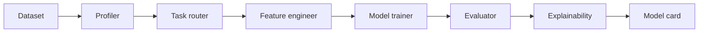

# 02 - Agentic ML Pipeline (Auto-EDA to Model Card)

[](https://github.com/milos-plavsic/agentic-ml-pipeline/actions/workflows/ci.yml)
[](https://www.python.org/downloads/)

An AI-driven machine learning workflow that inspects tabular data, selects modeling strategy, trains candidate models, explains outcomes, and exports a reproducible model card.

## Real-world data (education sector)

The default training path uses **`data/student-mat.csv`** from the UCI *Student Performance* dataset (secondary school mathematics, Portugal): [UCI ML Repository — Student Performance](https://archive.ics.uci.edu/dataset/320/student+performance). Citation: P. Cortez and A. Silva, *Using Data Mining to Predict Secondary School Student Performance*, FUBUTEC 2008.

The starter trains a **Random Forest regressor** to predict **final math grade `G3`** from questionnaire and prior-grade features (one-hot encoded categoricals).

## Quickstart

```bash
make install
make run
make api
make test
```

Docker API: `make docker-api`.

## Related repos (tabular ensembles)

- [tabular-ensemble-arena](https://github.com/milos-plavsic/tabular-ensemble-arena) — **Random Forest**, **XGBoost**, and **CatBoost** on numeric tabular data with stratified CV and a leaderboard API.
- [categorical-boost-lab](https://github.com/milos-plavsic/categorical-boost-lab) — mixed numeric + categorical features: **OneHot + RF**, **Ordinal + XGBoost**, **native CatBoost**.
- [education-nn-predictor](https://github.com/milos-plavsic/education-nn-predictor) — **PyTorch MLP** on the same UCI student-math cohort (`G3` regression).

## API

- OpenAPI docs: `http://127.0.0.1:8000/docs`
- Health: `GET /health`
- Pipeline run: `POST /v1/pipeline/run` with JSON body `{"dataset_name":"uci_student_math"}` (only this dataset key is supported today)

## Architecture



## Core Capabilities

- Dataset profiling and quality diagnostics.
- Dynamic task routing (classification vs regression vs time-series).
- Feature engineering recommendations and application.
- Automated model comparison with cross-validation.
- SHAP explainability snapshots and drift baseline capture.

## Architecture (Graph)

`ingest_data -> data_profiler -> task_router -> feature_engineer -> model_trainer -> evaluator -> explainability -> model_card_writer -> artifact_publisher`
